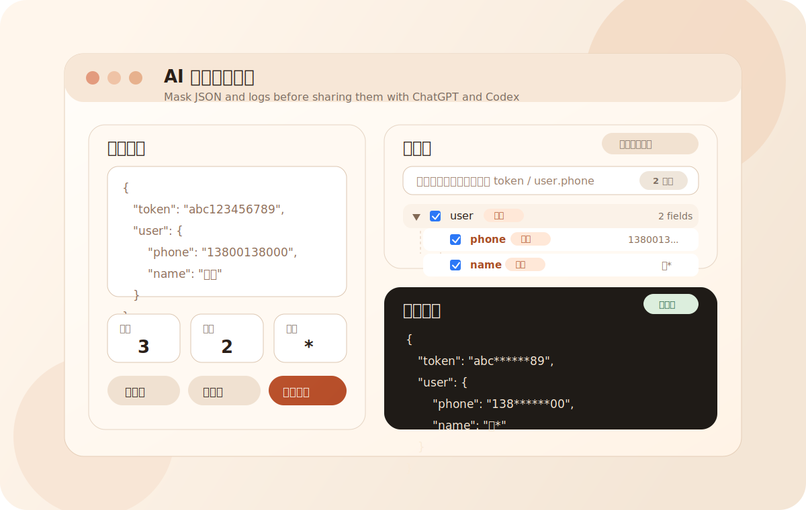

# AI Chat Privacy Masker

> AI 对话脱敏助手

AI Chat Privacy Masker 是一个轻量的 Chrome / Edge 扩展，用来在把 JSON、日志、报错信息发送给 ChatGPT、Codex 等 AI 工具之前，先做本地脱敏。

AI Chat Privacy Masker is a lightweight Chrome / Edge extension for redacting JSON, logs, and error messages before sharing them with AI tools like ChatGPT and Codex.

## 为什么做这个 / Why

和 AI 一起排查问题时，最容易发生的一件事，就是把敏感信息直接复制进对话框，比如：

When debugging with AI, it is easy to paste sensitive data by accident, such as:

- access token / cookie
- 手机号 / 邮箱
- 身份证字段 / 真实姓名
- session、userId、内部报错 payload

这个扩展在“发送给 AI 之前”增加了一层本地检查和脱敏步骤。

This extension adds a local review step before anything is shared with AI.

## 界面预览 / Preview



## 功能特性 / Features

- 默认对所有 JSON 叶子字段全打码
- 支持保留前几位和后几位，方便定位问题
- 支持树状字段查看、展开、整组勾选和单字段放行
- 支持按字段名或 JSON 路径搜索
- 自动高亮敏感字段，如 `token`、`authorization`、`phone`、`email`、`idcard`、`name`、`userid`
- 输入不是合法 JSON 时，自动退回纯文本逐行打码
- 一键复制脱敏结果
- 全程本地运行，不依赖远端服务

- Mask all JSON leaf fields by default
- Keep a configurable prefix and suffix for easier debugging
- Review fields in a tree view with expand / collapse interaction
- Search by field name or JSON path
- Highlight likely sensitive keys such as `token`, `authorization`, `phone`, `email`, `idcard`, `name`, and `userid`
- Fall back to plain-text line masking when the input is not valid JSON
- Copy the sanitized result with one click
- Run fully locally in the browser popup

## 典型使用场景 / Typical Use Cases

- 把后端接口返回发给 ChatGPT 前先脱敏
- 把前端报错 payload 发给 Codex 时避免暴露用户信息
- 在发 bug 报告或团队协作前先清洗日志
- 使用 AI 分析第三方 JSON 数据前做一次安全检查

- Share API responses with ChatGPT without leaking user data
- Paste frontend error payloads into Codex more safely
- Sanitize bug reports before sending them to teammates or external tools
- Review third-party JSON payloads before using them in AI prompts

## 安装方式 / Installation

### 方式一：直接下载打包文件 / Option 1: Download packaged build

可以从 GitHub Release 下载：

You can download packaged builds from GitHub Releases:

- `.crx`: [ai-chat-privacy-masker-v0.1.0.crx](https://github.com/frey77/ai-chat-privacy-masker/releases/download/v0.1.0/ai-chat-privacy-masker-v0.1.0.crx)
- `.zip`: [ai-chat-privacy-masker-v0.1.0.zip](https://github.com/frey77/ai-chat-privacy-masker/releases/download/v0.1.0/ai-chat-privacy-masker-v0.1.0.zip)

说明：`CRX` 在部分浏览器里可能无法直接双击安装。如果浏览器阻止安装，建议使用下面的“加载已解压扩展”方式。

Note: Some browsers may block direct `CRX` installation. If that happens, use the unpacked install flow below.

### 方式二：加载源码目录 / Option 2: Load unpacked

1. 打开 Chrome 或 Edge 扩展页面。
2. 开启开发者模式。
3. 点击 `加载已解压的扩展程序 / Load unpacked`。
4. 选择当前项目目录。

1. Open the browser extensions page.
2. Enable Developer Mode.
3. Click `Load unpacked`.
4. Select this project folder.

## 使用方法 / How To Use

1. 点击扩展图标。
2. 粘贴 JSON、日志或报错文本。
3. 查看字段树，默认全部打码。
4. 如果需要，可搜索字段名或路径。
5. 取消勾选你确认可以暴露的字段。
6. 复制脱敏结果，再发送给 AI。

1. Click the extension icon.
2. Paste JSON, logs, or error text.
3. Review the field tree. Everything is masked by default.
4. Search for a field or path if needed.
5. Uncheck fields that are safe to reveal.
6. Copy the redacted output and send it to your AI tool.

## 项目结构 / Project Structure

```text
ai-chat-privacy-masker/
├─ assets/
│  ├─ icons/
│  └─ screenshots/
├─ dist/
│  └─ ai-chat-privacy-masker-v0.1.0.zip
├─ manifest.json
├─ popup.html
├─ popup.css
├─ popup.js
├─ README.md
├─ CHANGELOG.md
├─ LICENSE
└─ .gitignore
```

## 打包说明 / Packaging Notes

当前 Release 已提供 `.zip` 和 `.crx` 两种分发形式。

The current Release includes both `.zip` and `.crx` distribution artifacts.

如果你要重新本地打包：

If you want to rebuild locally:

- `.zip` 可直接将扩展文件打包为压缩包
- `.crx` 可通过 Chrome 的 `--pack-extension` 命令生成

- `.zip` can be created by archiving the extension files
- `.crx` can be generated with Chrome's `--pack-extension` command

## 路线图 / Roadmap

- 高亮搜索命中的关键字
- 增加 `仅看敏感字段 / Only show sensitive fields` 开关
- 支持右键菜单处理选中文本
- 支持对 AI 网站输入框做更直接的粘贴集成

- Highlight matched search keywords inside field names
- Add an `Only show sensitive fields` toggle
- Add context-menu support for selected text
- Add direct paste integration for AI chat websites

## License

MIT
