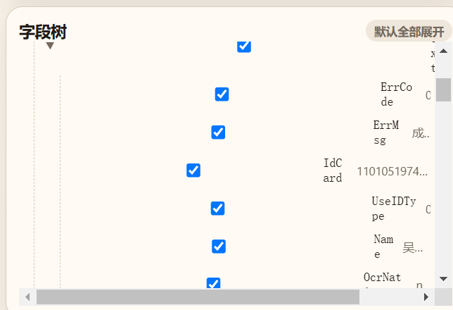

# AI Chat Privacy Masker

> AI 对话脱敏助手

AI Chat Privacy Masker is a lightweight Chrome / Edge extension for redacting JSON, logs, and error messages before sharing them with AI tools like ChatGPT and Codex.

## Why

When debugging with AI, it is easy to paste sensitive data by accident:

- access tokens and cookies
- phone numbers and email addresses
- ID card fields and real names
- session values, user IDs, and internal error payloads

This extension adds a local review step before you share anything with AI.

## Screenshots

### Popup UI



## Features

- Mask all JSON leaf fields by default
- Keep a configurable prefix and suffix for easier debugging
- Review fields in a tree view with expand / collapse interaction
- Search by field name or JSON path
- Highlight likely sensitive keys such as `token`, `authorization`, `phone`, `email`, `idcard`, `name`, and `userid`
- Fall back to plain-text line masking when the input is not valid JSON
- Copy the sanitized result with one click
- Run fully locally in the browser popup

## Typical Use Cases

- Share API responses with ChatGPT without leaking user data
- Paste frontend error payloads into Codex more safely
- Sanitize bug reports before sending them to teammates or external tools
- Review third-party JSON payloads before using them in AI prompts

## Installation

### Chrome / Edge unpacked install

1. Open the browser extensions page.
2. Enable Developer Mode.
3. Click `Load unpacked`.
4. Select this project folder.

## How To Use

1. Click the extension icon.
2. Paste JSON, logs, or error text.
3. Review the field tree. Everything is masked by default.
4. Search for a field or path if needed.
5. Uncheck fields that are safe to reveal.
6. Copy the redacted output and send it to your AI tool.

## Project Structure

```text
ai-chat-privacy-masker/
├─ assets/
│  ├─ icons/
│  └─ screenshots/
├─ manifest.json
├─ popup.html
├─ popup.css
├─ popup.js
├─ README.md
├─ CHANGELOG.md
├─ LICENSE
└─ .gitignore
```

## Roadmap

- Highlight matched search keywords inside field names
- Add an `Only show sensitive fields` toggle
- Add context-menu support for selected text
- Add direct paste integration for AI chat websites

## License

MIT
